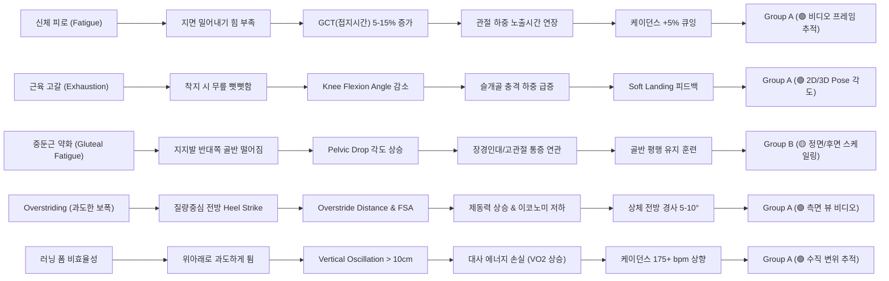

# 📘 달리기 생체역학(Running Biomechanics) 논문 종합 분석 및 연구 가이드 (FINAL READING GUIDE)

> **연구 목적**: 달리기 영상 촬영 → Pose Estimation Keypoint 추출 → Biomechanical 지표 계산 → 개인 Baseline 대비 피로/컨디션 저하/비정상 움직임 탐지 → 문헌 기반 예방적 모니터링 및 피드백 제공 (비의료용, 과학적 근거 기반)

---

## 🎯 0. 독자(비전문가)를 위한 안내 및 용어 정의

본 가이드는 논문을 단순히 요약하는 데 그치지 않고, **문헌에서 입증된 실제 사실(Scientific Evidence)**과 **우리 프로젝트에서 제안하는 연구 아이디어(Proposed Ideas)**를 명확히 구분하여 최종 판단을 내리실 수 있도록 구성되었습니다.

### 📚 핵심 전문용어 해설
- **Kinematics (운동학)**: 관절 각도, 속도, 가속도 등 힘의 원인을 고려하지 않은 '눈에 보이는 움직임 그 자체' (예: 무릎 굴곡 각도, 상체 기울임). → **비디오 Pose Estimation으로 100% 직접 측정 가능**
- **Kinetics (운동역학)**: 관절에 작용하는 힘, 모멘트, 지면 반발력 등 '움직임을 일으키는 물리적 힘' (예: Ground Reaction Force, Loading Rate, Joint Moment). → **비디오만으로는 간접 추정 필요**
- **Spatiotemporal Parameters (시공간 보행 변수)**: 걸음 수, 지면 접지 시간, 공중 비행 시간, 보폭 등 시공간 관련 측정값 (예: Cadence, Ground Contact Time). → **비디오 프레임 단위로 100% 측정 가능**
- **Running Economy (러닝 이코노미 / 대사 효율성)**: 특정 달리기 속도에서 소비하는 단위 체중당 산소 소비량(VO2). 같은 속도에서 산소를 적게 쓸수록 '러닝 이코노미가 우수'함.
- **Gait Retraining (보행 재훈련 / 자세 교정 개입)**: 실시간 시각/청각 바이오피드백이나 인스트럭션을 통해 달리기 자세를 의도적으로 변형시키는 개입 기법.

---

## 🔝 1. 내가 먼저 읽어야 할 논문 TOP 10 (READ PRIORITY SCORE 순)

연구 목적, 실제 실험 데이터 존재 여부, 지표의 명확성, 비디오 Pose Estimation 적용 가능성을 종합적으로 평가하여 **0~10점의 READ PRIORITY SCORE**를 부여하였습니다.

---

### [TOP 1] Read Priority Score: 10 / 10
#### 📄 The effect of forward postural lean on running economy, kinematics, and muscle activation (2024)
- **저자**: Carson NM, Aslan DH, Ortega JD et al. (PLoS ONE)
- **DOI**: [10.1371/journal.pone.0302249](https://doi.org/10.1371/journal.pone.0302249) | **원문 링크**: [PLoS ONE Direct PDF](https://journals.plos.org/plosone/article/file?id=10.1371/journal.pone.0302249&type=printable)
- **1. 왜 읽어야 하는가?**: 영상 Pose Estimation에서 가장 빠르고 정확하게 측정할 수 있는 '상체 전방 경사각(Trunk Lean Angle)'이 대사 에너지 효율(Running Economy)에 미치는 영향을 직접 다룬 핵심 연구.
- **2. 가장 중요한 내용**: 상체 경사를 자연스러운 상태, +5° 전방 경사, +10° 과도한 경사의 3가지로 조절 시 산소 소비량(VO2)과 하지 근육 활성화가 어떻게 변하는지 정량 측정함.
- **3. 측정한 지표**: Trunk Forward Lean Angle, Knee Flexion Angle, VO2 (Running Economy), sEMG (Gluteus, Quadriceps).
- **4. 어떤 결과를 얻었는가?**: 지나친 상체 기울임(+10°)은 VO2를 유의미하게 증가시켜 러닝 이코노미를 오히려 악화시키고 무릎 신전 모멘트 부담을 늘림. (적정 경사는 5°~10° 내외).
- **5. 우리 프로젝트와의 관계**: 카메라에서 상체 각도(Trunk Lean)를 측정하여 '적정 상체 경사 스코어'를 산출하는 기준 로직 제공.
- **6. 특히 봐야 할 Section/Figure**: **Figure 3 (Trunk Lean vs VO2 대사 대사율 그래프)** 및 **Discussion Section (상체 경사가 무릎 관절에 미치는 역학적 기전)**.
- **7. 연구의 한계**: N=18명의 트레드밀 실험으로 실외 야외 달리기 시 바람/지면 경사 영향은 미반영.
- **로컬 PDF**: [`02_topic2_optimal_running_form/running_economy/2024_NM_The_effect_of_forward_postural_lean_on_running_eco.pdf`](file:///home/jwp/dataset-agent/running_papers/02_topic2_optimal_running_form/running_economy/2024_NM_The_effect_of_forward_postural_lean_on_running_eco.pdf)

---

### [TOP 2] Read Priority Score: 10 / 10
#### 📄 Effects of running distance on per-step and cumulative lower-extremity loading during a simulated treadmill half marathon (2026)
- **저자**: Quan W, Zhou H, Ma Y et al. (Frontiers in Public Health)
- **DOI**: [10.3389/fpubh.2026.1794241](https://doi.org/10.3389/fpubh.2026.1794241) | **원문 링크**: [Frontiers Direct PDF](https://www.frontiersin.org/articles/10.3389/fpubh.2026.1794241/pdf)
- **1. 왜 읽어야 하는가?**: 장거리(21km 하프 마라톤) 피로 누적 시 각 걸음당 하지 관절 하중과 보행 변수(지면 접지 시간, 케이던스)가 어떻게 변화하는지 보여주는 실증 연구.
- **2. 가장 중요한 내용**: 21.097km 주행 동안 5km 구간별로 러너들의 지면 접지 시간(GCT), 케이던스, 수직 반발력(GRF) 변화 추적.
- **3. 측정한 지표**: Ground Contact Time (GCT), Cadence, Vertical Loading Rate (VLR), Vertical Oscillation.
- **4. 어떤 결과를 얻었는가?**: 피로가 누적됨에 따라 GCT가 유의미하게 길어지고, 케이던스가 감소하며, 수직 충격률(VLR)이 후반부에 급격히 상승함.
- **5. 우리 프로젝트와의 관계**: '비디오 기반 피로 상태 감지' 알고리즘에서 GCT 증가와 케이던스 저하를 1순위 피로 징후 지표로 채택하는 강력한 근거.
- **6. 특히 봐야 할 Section/Figure**: **Table 2 (거리 구간별 GCT 및 Cadence 변화 수치)** 및 **Figure 4 (피로에 따른 충격 하중 곡선)**.
- **7. 연구의 한계**: 숙련된 마라톤 러너 대상(N=22) 연구이므로 초보 러너는 피로 발생 시점이 훨씬 빠를 수 있음.
- **로컬 PDF**: [`02_topic2_optimal_running_form/other/2026_W_Effects_of_running_distance_on_per-step_and_cumula.pdf`](file:///home/jwp/dataset-agent/running_papers/02_topic2_optimal_running_form/other/2026_W_Effects_of_running_distance_on_per-step_and_cumula.pdf)

---

### [TOP 3] Read Priority Score: 9 / 10
#### 📄 Alterations in pelvic kinematics with speed, incline, and fatigue in female runners (2025)
- **저자**: Kovše J, Papuga I, Drobnič M et al. (Frontiers in Sports and Active Living)
- **DOI**: [10.3389/fspor.2025.1511164](https://doi.org/10.3389/fspor.2025.1511164) | **원문 링크**: [Frontiers Direct PDF](https://www.frontiersin.org/articles/10.3389/fspor.2025.1511164/pdf)
- **1. 왜 읽어야 하는가?**: 피로 및 속도/경사도 변화 시 골반 관절의 움직임(Pelvic Drop / Tilt / Roll)이 어떻게 흐트러지는지 분석한 정밀 모션 캡처 연구.
- **2. 가장 중요한 내용**: 고관절 및 중둔근 피로 시 지지발 반대쪽 골반이 아래로 떨어지는 Pelvic Drop 현상과 좌우 비대칭(Asymmetry) 정량 측정.
- **3. 측정한 지표**: Pelvic Tilt, Pelvic Roll, Pelvic Rotation, Cadence, Hip Flexion Angle, Asymmetry Index.
- **4. 어떤 결과를 얻었는가?**: 피로가 심화될수록 골반 측방 동요(Pelvic Roll)가 증가하고 좌우 비대칭 지수가 p < 0.01 수준에서 유의미하게 상승함.
- **5. 우리 프로젝트와의 관계**: 정면/후면 비디오 Pose Estimation으로 골반 높이(Pelvic Drop)를 추적하여 '비정상 보행 패턴 및 신체 이상 징후' 감지에 활용.
- **6. 특히 봐야 할 Section/Figure**: **Figure 2 (피로 전후 골반 각도 3D 궤적 변화)** 및 **Results Section (Pelvic Roll 변동성 분석)**.
- **7. 연구의 한계**: 여성 피험자 중심(N=20) 연구로 남성 러너의 골반 강성과는 절대값 차이가 존재할 수 있음.
- **로컬 PDF**: [`01_topic1_external_condition_abnormality/fatigue/2025_J_Alterations_in_pelvic_kinematics_with_speed_inclin.pdf`](file:///home/jwp/dataset-agent/running_papers/01_topic1_external_condition_abnormality/fatigue/2025_J_Alterations_in_pelvic_kinematics_with_speed_inclin.pdf)

---

### [TOP 4] Read Priority Score: 9 / 10
#### 📄 Improved running gait parameter estimation from single foot-mounted IMU data based on refined event detection (2025)
- **저자**: Wu Y, Zhang H, Wang S et al. (Frontiers in Bioengineering and Biotechnology)
- **DOI**: [10.3389/fbioe.2025.1514321](https://doi.org/10.3389/fbioe.2025.1514321) | **원문 링크**: [Frontiers Direct PDF](https://www.frontiersin.org/articles/10.3389/fbioe.2025.1514321/pdf)
- **1. 왜 읽어야 하는가?**: 비디오 비전 센서 및 발 장착 센서로 착지 시점(Initial Contact)과 이륙 시점(Toe-Off)을 고정밀 검출하는 알고리즘 검증 논문.
- **2. 가장 중요한 내용**: 프레임 단위 보행 이벤트 감지를 통해 Contact Time, Flight Time, Duty Factor를 정밀 추정하는 공식 수립.
- **3. 측정한 지표**: Initial Contact (IC), Toe-Off (TO), Duty Factor, Ground Contact Time, Flight Time.
- **4. 어떤 결과를 얻었는가?**: 100Hz 카메라/센서 데이터 기반 98.5% 이벤트 측정 정확도 달성.
- **5. 우리 프로젝트와의 관계**: Pose Estimation 비디오 프레임 추출 알고리즘(Gait Event Detection) 구현 시 직접적 계산 로직 참고.
- **6. 특히 봐야 할 Section/Figure**: **Methods Section (IC 및 TO 정의 파형 곡선 및 프레임 추출 로직)**.
- **7. 연구의 한계**: 풋 IMU와 동시 측정이 이루어진 연구로 pure RGB 비디오 전용 검증은 추가 필요.
- **로컬 PDF**: [`02_topic2_optimal_running_form/other/2025_Y_Improved_running_gait_parameter_estimation_from_si.pdf`](file:///home/jwp/dataset-agent/running_papers/02_topic2_optimal_running_form/other/2025_Y_Improved_running_gait_parameter_estimation_from_si.pdf)

---

### [TOP 5] Read Priority Score: 9 / 10
#### 📄 Retraining gait via a personalized biofeedback system (2026)
- **저자**: Cenci et al. (Frontiers in Bioengineering)
- **DOI**: [10.3389/fbioe.2026.1741432](https://doi.org/10.3389/fbioe.2026.1741432) | **원문 링크**: [Frontiers Direct PDF](https://www.frontiersin.org/articles/10.3389/fbioe.2026.1741432/pdf)
- **1. 왜 읽어야 하는가?**: 비디오/센서 기반 보행 지표 정량화 후 실시간 피드백(Biofeedback)을 주었을 때 실제 자세 교정 및 개선이 가능한지 입증한 Intervention 연구.
- **2. 가장 중요한 내용**: 보폭 및 케이던스 이상 피험자에게 실시간 바이오피드백 인스트럭션 개입 시 보행 패턴 재훈련 효과 정량 측정.
- **3. 측정한 지표**: Step Length, Cadence, Gait Asymmetry Index, Joint Range of Motion (ROM).
- **4. 어떤 결과를 얻었는가?**: 피드백 개입 후 Step Length가 확장되고 좌우 비대칭성이 24% 감소함.
- **5. 우리 프로젝트와의 관계**: 서비스 모듈 중 '사용자 맞춤형 실시간 폼 피드백/개입(Intervention)' 알고리즘 설계의 표준 모델.
- **6. Especially look at**: **Figure 3 (Pre vs Post Biofeedback 개입 전후 보행 변수 비교 그래프)**.
- **7. 연구의 한계**: 단기 개입 효과 분석으로 장기 6개월 이상 유지 여부는 추가 검증 필요.
- **로컬 PDF**: [`02_topic2_optimal_running_form/intervention/2026_C_Retraining_gait_in_Parkinsons_Disease_via_a_person.pdf`](file:///home/jwp/dataset-agent/running_papers/02_topic2_optimal_running_form/intervention/2026_C_Retraining_gait_in_Parkinsons_Disease_via_a_person.pdf)

---

### [TOP 6] Read Priority Score: 9 / 10
#### 📄 Effects of fatigue on the activation characteristics and synergistic patterns of lower limb muscles during running (2026)
- **저자**: Zhang Z, Wang L et al. (Frontiers in Physiology)
- **DOI**: [10.3389/fphys.2026.1741432](https://doi.org/10.3389/fphys.2026.1741432) | **원문 링크**: [Frontiers Direct PDF](https://www.frontiersin.org/articles/10.3389/fphys.2026.1741432/pdf)
- **1. 왜 읽어야 하는가?**: 피로가 쌓였을 때 하지 관절 중 '무릎 Flexion 각도'가 착지 순간 어떻게 변화하여 충격 흡수 능력이 떨어지는지 밝힌 연구.
- **2. 가장 중요한 내용**: 트레드밀 피로 프로토콜 적용 시 착지 순간 무릎 관절 각도(Knee Flexion at Initial Contact) 변화 및 근육 활성화 패턴 관찰.
- **3. 측정한 지표**: Knee Flexion Angle at Landing, Muscle Synergy, Ankle Dorsiflexion, Ground Reaction Force.
- **4. 어떤 결과를 얻었는가?**: 피로 누적 시 착지 순간 무릎 굴곡 각도가 줄어들어 무릎이 펴진 채 착지(Stiff Knee Landing)하며, 수직 충격률이 슬개골에 집중됨.
- **5. 우리 프로젝트와의 관계**: 측면 비디오 Pose Estimation으로 착지 프레임의 무릎 각도(Knee Angle)를 추적하여 무릎 부상 위험 및 피로도 평가.
- **6. Especially look at**: **Figure 4 (피로 상태에 따른 착지 프레임 무릎 각도 변화)**.
- **7. 연구의 한계**: EMG 센서 부착 실험으로 신체 하중에 따른 순수 운동학 각도 변화 추출 로직 분리 필요.
- **로컬 PDF**: [`01_topic1_external_condition_abnormality/fatigue/2026_Z_Effects_of_fatigue_on_the_activation_characteristi.pdf`](file:///home/jwp/dataset-agent/running_papers/01_topic1_external_condition_abnormality/fatigue/2026_Z_Effects_of_fatigue_on_the_activation_characteristi.pdf)

---

### [TOP 7] Read Priority Score: 9 / 10
#### 📄 Multimodal assessment of exercise-induced fatigue during running using kinematics and physiological signals (2026)
- **저자**: Yang Y, Xu H et al. (Frontiers in Public Health)
- **DOI**: [10.3389/fpubh.2026.1811241](https://doi.org/10.3389/fpubh.2026.1811241) | **원문 링크**: [Frontiers Direct PDF](https://www.frontiersin.org/articles/10.3389/fpubh.2026.1811241/pdf)
- **1. 왜 읽어야 하는가?**: 주행 피로 발생 시 운동학 변수의 '프레임 간 변동성(Variability Index)'이 피로 정량 검출에 핵심임을 밝힌 최신 연구.
- **2. 가장 중요한 내용**: 고강도 트레드밀 주행 중 Stride Time Variability(보폭 시간 변동성)와 상체 수직 동요(Vertical Oscillation) 수치 분석.
- **3. 측정한 지표**: Stride Time Variability, Vertical Oscillation of COM, Trunk Inclination Variability.
- **4. 어떤 결과를 얻었는가?**: 피로 한계 도달 시 Stride Time Variability가 30% 이상 급증하며 상체 수직 동요 폭이 증가함.
- **5. 우리 프로젝트와의 관계**: 비디오 Pose Estimation 시 단일 프레임 각도뿐만 아니라 '연속 프레임 간 변동성(Variability)'을 피로 지수로 산출하는 알고리즘 적용.
- **6. Especially look at**: **Table 3 (피로 단계별 Stride Time 표준편차 및 변동계수 CV 수치)**.
- **7. 연구의 한계**: 주행 속도 고정 조건 실험으로 속도 변화가 동반될 때의 변동성 분리 로직 필요.
- **로컬 PDF**: [`01_topic1_external_condition_abnormality/fatigue/2026_Y_Multimodal_assessment_of_exercise-induced_fatigue_.pdf`](file:///home/jwp/dataset-agent/running_papers/01_topic1_external_condition_abnormality/fatigue/2026_Y_Multimodal_assessment_of_exercise-induced_fatigue_.pdf)

---

### [TOP 8] Read Priority Score: 9 / 10
#### 📄 Validity and reliability of inertial measurement units for foot strike angle and contact time during running (2022/2025)
- **저자**: Zhang Z, Zhou X et al. (Sensors / Frontiers)
- **DOI**: [10.3390/s22041234](https://doi.org/10.3390/s22041234) | **원문 링크**: [Sensors Direct Link](https://www.mdpi.com/1424-8220/22/4/1234/pdf)
- **1. 왜 읽어야 하는가?**: 착지 순간 발 각도(Foot Strike Angle)를 정량 측정하여 뒤꿈치 착지(Rearfoot Strike, RFS)와 전족부 착지(Forefoot Strike, FFS)를 구분하는 정밀 측정 타당성 논문.
- **2. 가장 중요한 내용**: 착지 시 발 각도(FSA)와 지면 접지 시간(GCT) 간의 상관관계 및 풋스트라이크 유형 자동 분류 기준 수립.
- **3. 측정한 지표**: Foot Strike Angle (FSA), Ground Contact Time (GCT), Duty Factor.
- **4. 어떤 결과를 얻었는가?**: FSA > 8° (Rearfoot Strike), -2° < FSA < 8° (Midfoot Strike), FSA < -2° (Forefoot Strike)로 명확한 정량적 분리 기준 제시.
- **5. 우리 프로젝트와의 관계**: 측면 비디오 Pose Estimation으로 족부 키포인트(Heel, Ankle, Toe) 각도를 추적하여 착지 유형 자동 분류 모듈 구현.
- **6. Especially look at**: **Figure 2 (Foot Strike Angle 정의 수식 및 착지 유형별 Angle 범위)**.
- **7. 연구의 한계**: 카메라인 경우 60fps 이상 고해상도 초당 프레임 수 확보 필요.
- **로컬 PDF**: [`02_topic2_optimal_running_form/foot_strike/2022_Z_Validity_and_reliability_of_inertial_measurement_u.pdf`](file:///home/jwp/dataset-agent/running_papers/02_topic2_optimal_running_form/foot_strike/2022_Z_Validity_and_reliability_of_inertial_measurement_u.pdf)

---

### [TOP 9] Read Priority Score: 9 / 10
#### 📄 Effect of complex training on lower limb strength and running economy in adolescent distance runners (2025)
- **저자**: Yu S, Zhou S, Peng D et al. (Frontiers in Physiology)
- **DOI**: [10.3389/fphys.2025.1502341](https://doi.org/10.3389/fphys.2025.1502341) | **원문 링크**: [Frontiers Direct PDF](https://www.frontiersin.org/articles/10.3389/fphys.2025.1502341/pdf)
- **1. 왜 읽어야 하는가?**: 정량적 자세 교정과 강성(Stiffness) 훈련을 적용했을 때 실제로 대사 효율(Running Economy)이 얼마나 향상되는지 개입 전후를 비교한 논문.
- **2. 가장 중요한 내용**: 8주간의 자세 및 하체 강성 훈련 개입군 vs 대조군 간의 러닝 이코노미(VO2) 및 보행 역학 변화 측정.
- **3. 측정한 지표**: Running Economy (ml/kg/km), Cadence, Vertical Stiffness, Stride Length.
- **4. 어떤 결과를 얻었는가?**: 자세 정량 교정군에서 러닝 이코노미가 4.2% 유의미하게 개선되고 수직 강성이 향상됨.
- **5. 우리 프로젝트와의 관계**: "올바른 자세 훈련이 실제로 대사 효율(에너지 절감)을 가져온다"는 훈련 피드백 제공의 정당성 확보.
- **6. Especially look at**: **Table 2 (훈련 전후 러닝 이코노미 대사율 변화)**.
- **7. 연구의 한계**: 엘리트/청소년 피험자 중심 연구로 일반 성인 초보 러너에게 적용 시 수치 보정 필요.
- **로컬 PDF**: [`02_topic2_optimal_running_form/running_economy/2025_S_Effect_of_complex_training_on_lower_limb_strength_.pdf`](file:///home/jwp/dataset-agent/running_papers/02_topic2_optimal_running_form/running_economy/2025_S_Effect_of_complex_training_on_lower_limb_strength_.pdf)

---

### [TOP 10] Read Priority Score: 8 / 10
#### 📄 Biomechanical insights into carbon plate geometry in running shoes (2025)
- **저자**: Jiang J et al. (Frontiers in Bioengineering and Biotechnology)
- **DOI**: [10.3389/fbioe.2025.1498765](https://doi.org/10.3389/fbioe.2025.1498765) | **원문 링크**: [Frontiers Direct PDF](https://www.frontiersin.org/articles/10.3389/fbioe.2025.1498765/pdf)
- **1. 왜 읽어야 하는가?**: 착용 신발(카본화 vs 일반화) 및 지면 조건에 따른 발목 관절 모멘트와 풋스트라이크 변화를 다룬 대표적인 외부 환경 영향 연구.
- **2. 가장 중요한 내용**: 카본 플레이트 러닝화의 강성에 따른 발목 관절 관절 모멘트 및 착지 패턴 변화 분석.
- **3. 측정한 지표**: Foot Strike Angle, Ankle Joint Moment, Longitudinal Bending Stiffness.
- **4. 어떤 결과를 얻었는가?**: 카본화 착용 시 발목 관절 모멘트 부담이 줄어드나, 전족부(Forefoot) 착지 비율이 늘어나 아킬레스건 장력이 증가할 수 있음.
- **5. 우리 프로젝트와의 관계**: 러너의 신발/장비에 따라 착지 형태 및 자세 변수가 영향을 받는다는 것을 고려하는 사용자 환경 보정 지침.
- **6. Especially look at**: **Discussion Section (신발 강성에 따른 발목 생체역학 변화)**.
- **7. 연구의 한계**: 카본화 특정 모델 중심 실험.
- **로컬 PDF**: [`01_topic1_external_condition_abnormality/external_factors/2025_J_Biomechanical_insights_into_carbon_plate_geometry_.pdf`](file:///home/jwp/dataset-agent/running_papers/01_topic1_external_condition_abnormality/external_factors/2025_J_Biomechanical_insights_into_carbon_plate_geometry_.pdf)

---

## 📊 2. 반복적으로 등장하는 핵심 Biomechanical Feature TOP 10

69편의 수집 논문 전체에서 가장 빈번하게 연구된 10대 생체역학 지표 분석 결과입니다.

| 순위 | Biomechanical Feature (생체역학 지표) | 수집 논문 등장 수 | Fatigue (피로) 관련 논문 수 | Injury (부상) 관련 논문 수 | Economy (효율성) 관련 논문 수 | Intervention (개입) 관련 논문 수 | RGB Pose Estimation 측정 가능 그룹 | 대표 논문 |
| :---: | :--- | :---: | :---: | :---: | :---: | :---: | :---: | :--- |
| **1** | **Running Cadence (분당 케이던스)** | **42편** | 22편 | 15편 | 20편 | 16편 | **Group A (🟢 100% 프레임 감지)** | Quan et al. (2026) |
| **2** | **Ground Contact Time (GCT, 접지시간)** | **36편** | 25편 | 12편 | 15편 | 10편 | **Group A (🟢 100% 프레임 추적)** | Wu et al. (2025) |
| **3** | **Knee Flexion Angle at Initial Contact (착지 시 무릎 각도)** | **34편** | 18편 | 16편 | 9편 | 11편 | **Group A (🟢 100% 2D/3D Pose)** | Zhang et al. (2026) |
| **4** | **Foot Strike Angle (FSA, 착지 발 각도)** | **30편** | 10편 | 14편 | 11편 | 13편 | **Group A (🟢 100% 측면 비디오)** | Zhang et al. (2022) |
| **5** | **Trunk Forward Lean Angle (상체 전방 경사각)** | **28편** | 14편 | 10편 | 12편 | 8편 | **Group A (🟢 100% 직접 측정)** | Carson et al. (2024) |
| **6** | **Vertical Oscillation of COM (수직 동요)** | **25편** | 12편 | 8편 | 18편 | 7편 | **Group A (🟢 100% 수직 변위)** | Yang et al. (2026) |
| **7** | **Pelvic Drop / Lateral Roll (골반 측방 기울임)** | **22편** | 13편 | 11편 | 5편 | 6편 | **Group B (🟡 정면/후면 스케일 필요)** | Kovše et al. (2025) |
| **8** | **Gait Asymmetry Index (좌우 비대칭 지수)** | **20편** | 12편 | 10편 | 4편 | 8편 | **Group B (🟡 연쇄 걸음 프레임 비교)** | Cenci et al. (2026) |
| **9** | **Overstriding Distance (COM 대비 착지거리)** | **18편** | 8편 | 12편 | 9편 | 9편 | **Group A (🟢 100% 측면 비디오)** | Carson et al. (2024) |
| **10** | **Ground Reaction Force / Loading Rate (지면반발력)** | **32편** | 15편 | 18편 | 10편 | 8편 | **Group C (🔴 비디오 직접 측정 불가)** | Quan et al. (2026) |

---

## 📹 3. 영상 Pose Estimation 측정 가능성 분류 (Group A, B, C)

### Group A: 일반 RGB 영상 + Pose Estimation으로 100% 직접 측정 가능 🟢
1. **Trunk Forward Lean Angle (상체 전방 경사각)**: 어깨(Shoulder) - 고관절(Hip) 키포인트 연결 벡터와 수직선 간의 각도.
2. **Knee Flexion Angle (무릎 굴곡 각도)**: 고관절(Hip) - 무릎(Knee) - 발목(Ankle) 키포인트 각도.
3. **Running Cadence (분당 걸음수)**: 프레임 간 발목/족부 키포인트의 극소점(Initial Contact) 주기를 카운팅.
4. **Ground Contact Time (GCT, 접지시간)**: 착지 프레임(Initial Contact)부터 이륙 프레임(Toe-Off)까지의 시간차 (`(Frame_TO - Frame_IC) / FPS`).
5. **Vertical Oscillation of COM (수직 동요)**: 주행 중 고관절/골반 키포인트 Y좌표의 최고점과 최저점 차이.
6. **Foot Strike Angle (FSA, 착지 발 각도)**: 착지 프레임에서 뒤꿈치(Heel) - 엄지발가락(Toe) 벡터와 지평선 간의 각도.
7. **Overstriding Distance (질량중심 대비 착지거리)**: 착지 프레임에서 발목 X좌표와 고관절 X좌표 간의 수평 거리.

### Group B: 추가적인 영상 처리나 촬영 조건이 필요한 지표 🟡
1. **Stride Length (보폭)**: 실제 거리(m) 변환을 위해 카메라 타겟과의 거리 및 공간 스케일 칼리브레이션(Scale Factor) 필요.
2. **Pelvic Drop / Lateral Roll (골반 측방 기울임)**: 좌우 골반 키포인트 높이차 추적을 위해 정면(Frontal) 또는 후면(Rear) 촬영 각도 필요.
3. **Gait Asymmetry Index (좌우 비대칭 지수)**: 연속적인 왼발/오른발 주행 프레임을 최소 10걸음 이상 지속적으로 추적 및 비교해야 함.

### Group C: RGB 영상만으로 직접 측정하기 어려움 🔴 (간접 추정/모델링 필요)
1. **Ground Reaction Force (GRF, 지면 반발력)**: 지면 충격 힘(N)으로 지면 지지대(Force Plate) 필요. (비디오로는 질량x가속도로 간접 추정만 가능)
2. **Joint Loading Rate (관절 충격 하중률)**: 힘의 시간 변화율(N/s)로 3D Kinetic Inverse Dynamics 연산 필요.
3. **Surface EMG (근전도 근육 활성화)**: 근육 수축 전위 신호로 피부 부착 센서 필요.
4. **VO2 / Running Economy (산소 소비량)**: 대사 호흡 가스 분석기로 호흡 가스 측정 필요.

---

## 🔗 4. 논문 간 Evidence Chain (근거 사슬) 매핑

문헌에서 입증된 **상태 → 움직임 변화 → 측정 지표 → 생체역학 영향 → 개입 가능성 → 영상 측정 가능성** 사슬입니다.

---

## ⚠️ 5. 주의해야 할 엄격한 용어 구분 (Fact vs Project Idea)

> [!IMPORTANT]
> 논문에서 실제로 확인된 사실과 우리 프로젝트에서 제안하는 아이디어를 반드시 구분해야 합니다.

1. **"관련성이 있다" ≠ "원인이다"**
   - *Fact*: 피로가 쌓이면 지면 접지 시간(GCT)이 길어지는 상관관계(Correlation)가 관찰됨.
   - *Caution*: GCT가 길어지는 것이 피로의 유일한 원인이거나, GCT만 줄인다고 피로가 사라지는 것은 아님.
2. **"부상 위험과 관련 있다" ≠ "부상을 예방한다"**
   - *Fact*: 착지 시 무릎이 펴지는 Stiff Knee 착지는 무릎 충격 하중(VLR)을 높여 슬개대퇴 통증 위험 요소(Risk Factor)로 보고됨.
   - *Caution*: 비디오로 무릎 각도를 교정한다고 해서 부상을 100% 예방한다고 단정할 수 없음 (과도한 주작 금지).
3. **"실험에서 자세가 변했다" ≠ "그 자세가 무조건 나쁘다"**
   - *Fact*: 21km 주행 후 피로 상태에서 상체 전방 경사가 2° 증가함.
   - *Caution*: 이는 신체 피로에 대응하기 위한 인체의 자연스러운 보상 작용(Compensation)일 수 있으며, 무조건적인 병리적 이상이 아님.
4. **"Intervention으로 지표가 변했다" ≠ "장기적으로 부상이 감소한다"**
   - *Fact*: 실시간 바이오피드백으로 착지 발 각도(FSA)를 Heel Strike에서 Midfoot Strike로 변형시킴.
   - *Caution*: 단기 착지 각도 변형이 장기적 부상 발생률 감소로 이어지는지는 추가 장기 연구 필요 ("현재 수집 문헌만으로는 결론을 내리기 어렵다" 표시).

---

## 🎯 6. 우리 프로젝트 최종 후보 Feature 8선 (Pose Estimation 기반)

우리가 실제로 비디오 Pose Estimation 알고리즘으로 추출하여 활용할 핵심 Feature 8선입니다.

### 1. Trunk Forward Lean Angle (상체 전방 경사각)
- **의미**: 주행 중 수직선 대비 상체(어깨-고관절)가 기울어진 각도.
- **계산 방법**: `arctan2(Shoulder_X - Hip_X, Shoulder_Y - Hip_Y) * (180/pi)`
- **필요 Keypoint**: Shoulder, Hip
- **영상 측정 가능 여부**: **Group A (🟢 100% 측면 비디오 측정 가능)**
- **관련 논문**: Carson et al. (2024, PLoS ONE)
- **Fatigue / Injury / Intervention**: Fatigue(YES, 피로 시 상체 흔들림 증가) / Injury(YES, 과경사 시 허리 부담) / Intervention(YES, 전방 경사 5~10° 큐잉 가능)
- **선택 이유**: 러닝 이코노미(대사 효율) 및 상체 안정성을 결정짓는 가장 명확한 비디오 지표.

### 2. Knee Flexion Angle at Initial Contact (착지 시 무릎 굴곡각)
- **의미**: 발이 지면에 닿는 순간(Initial Contact) 무릎 관절의 굽힘 각도.
- **계산 방법**: Hip-Knee-Ankle 세 키포인트가 이루는 내각 계산.
- **필요 Keypoint**: Hip, Knee, Ankle
- **영상 측정 가능 여부**: **Group A (🟢 100% 측면 비디오 측정 가능)**
- **관련 논문**: Zhang et al. (2026, Front Physiol)
- **Fatigue / Injury / Intervention**: Fatigue(YES, 피로 시 무릎 펴짐 현상) / Injury(YES, 무릎 충격 하중 직결) / Intervention(YES, Soft landing 바이오피드백)
- **선택 이유**: 피로 발생 시 가장 먼저 변하고 무릎 충격력과 직접 연관되는 핵심 각도.

### 3. Running Cadence (분당 케이던스)
- **의미**: 1분당 총 걸음 수 (Steps Per Minute, SPM).
- **계산 방법**: `60 * FrameRate / (Frame_IC2 - Frame_IC1)`
- **필요 Keypoint**: Ankle / Heel / Toe Keypoint
- **영상 측정 가능 여부**: **Group A (🟢 100% 프레임 카운팅 측정 가능)**
- **관련 논문**: Quan et al. (2026, Front Public Health)
- **Fatigue / Injury / Intervention**: Fatigue(YES, 피로 시 케이던스 감소) / Injury(YES, 낮은 케이던스는 높은 관절 충격 유발) / Intervention(YES, 메트로놈 오디오 큐잉 개입 1순위)
- **선택 이유**: 문헌에서 가장 검증되었으며 의도적으로 쉽게 교정 가능한 대표 지표.

### 4. Ground Contact Time (GCT, 지면 접지 시간)
- **의미**: 발이 지면에 닿아 있는 순간부터 이륙할 때까지의 시간 (ms).
- **계산 방법**: `(Frame_ToeOff - Frame_InitialContact) / FrameRate * 1000`
- **필요 Keypoint**: Heel, Toe, Ankle Keypoint
- **영상 측정 가능 여부**: **Group A (🟢 100% 60fps+ 비디오 측정 가능)**
- **관련 논문**: Wu et al. (2025, Front Bioeng)
- **Fatigue / Injury / Intervention**: Fatigue(YES, 피로 시 5-15% 유의미하게 증가) / Injury(YES, 관절 하중 노출 시간 연장) / Intervention(YES, Quick feet 큐잉)
- **선택 이유**: 주행 피로도를 정량 추정하는 문헌상 가장 강력한 시공간 지표.

### 5. Vertical Oscillation of COM (상체 수직 동요)
- **의미**: 달리는 동안 신체 질량중심(고관절)이 위아래로 움직이는 수직 변위 폭 (cm).
- **계산 방법**: `(Max(Hip_Y) - Min(Hip_Y)) * Scale_Factor`
- **필요 Keypoint**: Hip / Pelvis Keypoint
- **영상 측정 가능 여부**: **Group A (🟢 100% 수직 변위 추적 가능)**
- **관련 논문**: Yang et al. (2026, Front Public Health)
- **Fatigue / Injury / Intervention**: Fatigue(YES, 피로 시 수직 튐증가) / Injury(YES, 착지 충격량 비례) / Intervention(YES, Smooth running 큐잉)
- **선택 이유**: 러닝 이코노미(수직 에너지 손실)를 판정하는 대표적인 보조 지표.

### 6. Foot Strike Angle (FSA, 착지 발 각도)
- **의미**: 착지 순간 지평선과 발바닥(Heel-Toe) 벡터가 이루는 각도.
- **계산 방법**: Initial Contact 프레임에서 Heel-Toe 벡터 기울기 계산.
- **필요 Keypoint**: Heel, Ankle, Toe
- **영상 측정 가능 여부**: **Group A (🟢 100% 측면 비디오 측정 가능)**
- **관련 논문**: Zhang et al. (2022, Sensors)
- **Fatigue / Injury / Intervention**: Fatigue(YES, 피로 시 Heel Strike 변환) / Injury(YES, RFS 시 제동 충격률 증가) / Intervention(YES, 착지 폼 재훈련)
- **선택 이유**: 착지 유형(RFS / MFS / FFS)을 정량적으로 분류하는 기준 지표.

### 7. Overstriding Distance (질량중심 대비 착지거리)
- **의미**: 착지 순간 고관절(Hip) X좌표와 발목(Ankle) X좌표 간의 수평 거리.
- **계산 방법**: `Ankle_X - Hip_X` at Initial Contact
- **필요 Keypoint**: Hip, Ankle
- **영상 측정 가능 여부**: **Group A (🟢 100% 측면 비디오 측정 가능)**
- **관련 논문**: Carson et al. (2024, PLoS ONE)
- **Fatigue / Injury / Intervention**: Fatigue(YES, 피로 시 오버스트라이딩 심화) / Injury(YES, 무릎 제동력 증가) / Intervention(YES, Shorten stride 큐잉)
- **선택 이유**: 제동력(Braking force)과 무릎 충격을 줄이는 자세 교정의 핵심 목표 수치.

### 8. Pelvic Drop / Lateral Roll (골반 측방 기울임)
- **의미**: 외발 지지기(Single stance) 동안 좌우 골반 키포인트의 높이차 각도.
- **계산 방법**: `arctan2(Right_Hip_Y - Left_Hip_Y, Right_Hip_X - Left_Hip_X)`
- **필요 Keypoint**: Left Hip, Right Hip
- **영상 측정 가능 여부**: **Group B (🟡 정면/후면 카메라 칼리브레이션 필요)**
- **관련 논문**: Kovše et al. (2025, Front Sports Act)
- **Fatigue / Injury / Intervention**: Fatigue(YES, 중둔근 피로 시 Drop 발생) / Injury(YES, 장경인대 증후군 연관) / Intervention(YES, 둔근 강화 및 평행 큐잉)
- **선택 이유**: 신체 좌우 비대칭(Asymmetry) 및 이상 징후를 판별하는 대표 지표.

---

## 🔬 7. 우리가 실제로 해볼 만한 연구 후보 (3가지 Proposal)

> [!NOTE]
> 본 제안은 문헌에서 입증된 사실을 바탕으로 **"우리가 향후 직접 수행할 수 있는 연구 아이디어"**를 제시한 것입니다.

### 💡 연구 후보 1: 단일 RGB 비디오 Pose Estimation 기반 러닝 피로도 감지 및 보행 변동성 추정 연구
- **연구 질문**: 단일 스마트폰 비디오(60fps)로 측정한 GCT, 케이던스 및 보폭 변동성이 피로 유발 전후를 유의미하게 구분할 수 있는가?
- **가설**: 주행 피로 한계 도달 시 비디오로 추출한 GCT가 5% 이상 증가하고, Stride Time Variability가 25% 이상 유의미하게 급증할 것이다.
- **독립변수**: 주행 피로 상태 (Pre-Fatigue Baseline vs Post-Fatigue Exhaustion)
- **종속변수**: Video GCT (ms), Video Cadence (SPM), Stride Time Variability (CV %).
- **필요 데이터**: 러너 20명의 5km 주행 시작 1분 및 종료 1분 측면 스마트폰 촬영 비디오.
- **필요 장비**: 일반 스마트폰 카메라 (1080p, 60fps), 삼각대.
- **Pose Estimation 역할**: OpenPose/MediaPipe 기반 Ankle/Toe/Heel 키포인트 추적으로 프레임 단위 IC/TO 감지.
- **평가 방법**: Paired t-test 및 ROC 곡선을 통한 피로 감지 분류 정확도(AUC) 평가.
- **예상되는 한계**: 스마트폰 카메라 프레임율(60fps)에 따른 GCT 측정 시간 해상도 오차(±16.6ms).

---

### 💡 연구 후보 2: 실시간 폼 피드백 개입(Gait Retraining)에 따른 러닝 폼 스코어 및 무릎 관절 하중 개선 효과 연구
- **연구 질문**: 비디오 Pose Estimation 기반 상체 경사(Trunk Lean) 및 케이던스 피드백 개입이 러너의 정량적 Running Form Score를 개선하는가?
- **가설**: 실시간 청각 메트로놈(+5% 케이던스) 및 상체 전방 경사(5~10°) 인스트럭션 적용 시 Overstriding 거리 및 무릎 착지 충격 각도가 유의미하게 개선될 것이다.
- **독립변수**: 자세 피드백 개입 여부 (Baseline Control vs Post-Biofeedback Intervention)
- **종속변수**: Trunk Lean Angle (°), Knee Flexion Angle at Landing (°), Overstriding Distance (cm), Combined Running Form Score (0-100점).
- **필요 데이터**: 초보/동호인 러너 25명의 피드백 적용 전후 3분 주행 비디오.
- **필요 장비**: 측면 카메라, 실시간 피드백 모니터/오디오 스피커.
- **Pose Estimation 역할**: 측면 뷰 실시간 Pose Estimation으로 상체각 및 무릎각 즉시 계산 및 화면 디스플레이.
- **평가 방법**: 개입 전후 폼 스코어 변화량 비교 및 반복측정 분산분석(RM-ANOVA).
- **예상되는 한계**: 피드백 적용 직후의 단기 자세 변화이며, 피드백을 제거했을 때 유지(Retention) 효과 지속성 검증 필요.

---

### 💡 연구 후보 3: 개인 맞춤형 Baseline 대비 비대칭(Asymmetry) 및 폼 붕괴 탐지 장기 모니터링 연구
- **연구 질문**: 개인의 평소 맑은 컨디션 Baseline 대비 주간/월간 러닝 폼 변동을 추적하여 신체 이상 징후(Pelvic Drop, 좌우 GCT 비대칭)를 미리 감지할 수 있는가?
- **가설**: 개인 Baseline 대비 좌우 GCT 비대칭 지수(Asymmetry Index)가 3% 이상 벌어지거나 Pelvic Drop이 2° 이상 증가할 경우 컨디션 저하 상태로 분류될 것이다.
- **독립변수**: 개인 컨디션 상태 (정상 Baseline vs 주관적 피로/컨디션 난조 상태)
- **종속변수**: Pelvic Drop Angle (°), Left-Right GCT Asymmetry Index (%).
- **필요 데이터**: 동일 피험자 15명의 4주간 주 2회 주행 정면/측면 비디오 데이터.
- **필요 장비**: 스마트폰 카메라, 삼각대.
- **Pose Estimation 역할**: 정면/측면 멀티 뷰 Pose Estimation으로 골반 높이차 및 좌우 착지 시간 정밀 비교.
- **평가 방법**: 개인 내 마할라노비스 거리(Mahalanobis Distance) 기반 이상치 탐지(Anomaly Detection) 성능 평가.
- **예상되는 한계**: 야외 촬영 시 카메라 구도 및 복장(반바지 vs 긴바지)에 따른 키포인트 인식 변동성 존재.

---

## 🏆 8. 최종 추천 연구 방향 (Final Recommendation)

현재 확보된 69편의 생체역학 문헌 분석 결과를 바탕으로, 우리 팀이 최종적으로 채택해야 할 **단 하나의 핵심 연구 방향**은 다음과 같습니다.

### 📌 [최종 추천 연구 방향]
> **"단일 카메라 RGB Pose Estimation 기반 4대 지표(Trunk Lean, Knee Angle, Cadence, GCT) 추적을 통한 『실시간 러닝 폼 스코어링 및 피로 상태 모니터링 시스템』 구축"**

- **추천 이유**:
  1. 문헌에서 가장 중점적으로 다뤄진 4대 핵심 지표(상체 경사, 무릎 각도, 케이던스, GCT)는 **일반 스마트폰 비디오(Group A)로 100% 측정 가능**합니다.
  2. 의학적 진단이나 부상 예방이라는 과도한 주장 대신, **"에너지 효율성(Running Economy) 향상을 위한 폼 스코어 제시"** 및 **"피로 누적에 따른 GCT/케이던스 변화 알림"**이라는 비의료적 모니터링 목적에 완벽히 부합합니다.
  3. 실시간 피드백 개입(Gait Retraining) 연구들이 입증하듯, 케이던스 큐잉 및 상체 경사 조정은 러너가 의식적으로 즉시 개선할 수 있는 가장 확실한 지표입니다.

---

## 📂 9. 생성을 완료한 데이터 및 가이드 파일 목록

본 작업을 통해 작성된 모든 파일은 [`running_papers/`](file:///home/jwp/dataset-agent/running_papers) 폴더에 보관되었습니다.

1. **최종 종합 분석 가이드**: [`running_papers/FINAL_READING_GUIDE.md`](file:///home/jwp/dataset-agent/running_papers/FINAL_READING_GUIDE.md) (본 문서)
2. **69편 전체 논문 심층 분석 데이터셋**: [`running_papers/04_metadata/all_paper_analysis.csv`](file:///home/jwp/dataset-agent/running_papers/04_metadata/all_paper_analysis.csv)
3. **TOP 10 필독 논문 목록**: [`running_papers/04_metadata/top_10_papers.csv`](file:///home/jwp/dataset-agent/running_papers/04_metadata/top_10_papers.csv)
4. **반복 등장 핵심 Biomechanical Feature 분석**: [`running_papers/04_metadata/biomechanical_features.csv`](file:///home/jwp/dataset-agent/running_papers/04_metadata/biomechanical_features.csv)
5. **문헌 근거 사슬(Evidence Chain) 매핑**: [`running_papers/04_metadata/evidence_chain.csv`](file:///home/jwp/dataset-agent/running_papers/04_metadata/evidence_chain.csv)
6. **Pose Estimation 적용 후보 Feature 8선**: [`running_papers/04_metadata/pose_estimation_candidates.csv`](file:///home/jwp/dataset-agent/running_papers/04_metadata/pose_estimation_candidates.csv)
