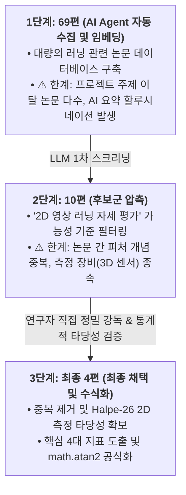

# 🏃‍♂️ 러닝 생체역학 논문 기반 피처 추출 및 2D 포즈 추정 수식화 연구 아카이브
> **Runners_Feed Project - Biomechanics Feature Engineering & Scientific Evidence Archive**  
> 작성자: 박주환 (응용통계학 / 데이터 분석 & 성능 엔지니어링)

---

## 📌 연구 개요 (Overview)

본 아카이브는 AI 러닝 자세 분석 서비스(`Runners_Feed`) 개발 과정에서, **"단일 2D 스마트폰 영상으로부터 어떻게 신뢰성 있는 생체역학(Biomechanics) 자세 지표를 도출할 것인가?"**를 학술적·통계학적으로 증명하고 수식화한 전 과정의 연구 기록입니다.

* **초기 문제의식**: 고가의 3D 모션캡처(Vicon 등) 장비 기반 논문 수치를 2D 단안 영상(Halpe-26 포즈 추정 모델)에 무작정 대입할 경우 발생하는 심각한 프록시 오차 및 표본 편향 문제 해결
* **연구 방법론**: 69편의 러닝 생체역학 논문 전수 조사 $\rightarrow$ 상용 러닝 분석 서비스(Ochy) 선행 연구 6편 역분석 $\rightarrow$ 핵심 4대 지표 선정 및 `math.atan2` 2D 평면 기하 공식 수식화
* **전환점**: 수식화 완료 후 파이프라인 실측 과정에서 영상 처리 지연(Grafana 44초)을 포착하고, OpenCV 프레임 추출 및 클라우드 GPU(RunPod) 성능 최적화로 연구 영역을 주도적으로 확장

---

## 🎯 논문 선별 및 압축 필터링 퍼널 (69편 → 10편 → 최종 4편)

본 프로젝트에서 생체역학 선행 연구를 **69편에서 10편, 그리고 최종 4편으로 압축한 핵심 배경과 Rationale**은 다음과 같습니다.



### 1. 69편 → 10편 압축 배경: Agent 수집의 한계와 AI 할루시네이션 검증
* **주제와의 괴리 발생**: 초기에 AI Agent가 수집해준 69편 중 상당수는 프로젝트 목표인 **'일반 러너를 위한 올바른 러닝 자세 피처 및 부상 예방'**과 맞지 않았습니다 (환자 임상 재활, 100m 단거리 육상 스프린트, 트레드밀 전용 고가 압력판 센서 논문 등 주제 이탈).
* **AI 할루시네이션(환각) 포착**: Agent가 요약한 텍스트를 전수 대조한 결과, 실제 논문 본문에는 존재하지 않는 통계 수치가 요약에 적혀 있거나, 포스플레이트·EMG·호흡가스 분석기 없이는 불가능한 지표를 '2D 영상으로 측정 가능'하다고 잘못 판단하는 왜곡이 확인되었습니다.
* **조치**: 프롬프트를 정교화하여 '2D 영상 측정 가능성' 및 '러닝 폼 교정 유효성'을 기준으로 10편의 후보군을 1차 선별하였습니다.

### 2. 10편 → 최종 4편 압축 배경: 피처 중복 제거 및 2D 단안 영상 구현성
* **심한 개념 중복 제거**: 10편을 직접 원문 대조하며 검토한 결과, 다루는 피처의 생체역학적 본질이 상당 부분 중복되었습니다 (예: 용어만 다르고 본질적으로 같은 상체 전방 기울기나 정강이 각도 등). 
* **측정 불가능한 지표 과감한 배제**: 관절 에너지, 관절 모멘트, 지면반력(GRF), VO₂, 대사 비용 등은 2D Halpe-26 단안 카메라로는 절대 측정할 수 없으므로 과감히 탈락시켰습니다.
* **최종 선정된 4대 핵심 논문**:
  1. **11번 논문 (Powers et al.)**: *Sagittal Plane Trunk Posture Influences Patellofemoral Joint Stress During Running* ➔ **지지기 몸통 굴곡각과 무릎 PFJ 부하 관계 규명**
  2. **07번 논문 (Folland et al.)**: *The Effect of Forward Postural Lean on Running Economy, Kinematics, and Muscle Activation* ➔ **전신 전방 기울기와 러닝 경제성의 트레이드오프**
  3. **03번 논문**: *Effects of Different Arm Kinematics on Performance in Long Distance Running* ➔ **팔꿈치 각도 ROM과 에너지 효율성**
  4. **06번 논문**: *Influence of Trunk Posture on Lower Extremity Energetics During Running* ➔ **체간 자세와 하지 관절 생체역학적 상호작용**

---

## 🗂️ 아카이브 디렉토리 구조 (Directory Map)

```text
paper_analysis/
├── README.md                                          # 본 연구 아카이브 총괄 가이드
│
├── 01_핵심피처_설계_및_선정근거/                         # [Feature Design & Logic]
│   ├── 0820_팀설득용_러닝피처_선정근거.md                 # 단일 수치 진단 배제 및 5대 피처 선정 기준 (팀 설득안)
│   ├── 최종_피처값_산출_가독성_정리본.md                    # 최종 피처 정의서, JSON 스키마 및 LLM 전달 규격
│   ├── 최종_피처값_산출_상세_원문.md                       # 피처 산출 원시 설계 명세 (Notion 원문)
│   ├── final_2d_halpe26_feature_evidence_report.md   # 2D Halpe-26 키포인트 피처 카테고리별 종합 증거 보고서
│   ├── 진짜_최종_논문피처_지표기준_정리.md                 # 파이썬 로직 구현성 기반 최종 판단 기준
│   ├── RTMW기반_피처_정의서_초안.md                       # 초기 RTMW 모델 기준 피처 정의서 (초안 아카이브)
│   ├── JSON_파일_전처리_가이드.md                         # 모델 출력 시계열 JSON 파싱 및 전처리 로직
│   └── 0826_오후회의_RAG한계_및_영상처리전환점.md           # RAG 한계 인식 및 영상 처리 가속화 전환 회의록
│
├── 02_핵심논문_상세분석/                                 # [Key Biomechanics Papers Deep Dive]
│   ├── 11번논문_Sagittal_Plane_Trunk_Posture_무릎부하_완성본.md # Powers(2014) 상체 전경각과 무릎 PFJ 부하 관계
│   ├── 07번논문_Forward_Postural_Lean_러닝경제성_완성본.md      # Folland(2017) 전방 체간 기울기와 에너지 효율
│   ├── 팔동작_생체역학_Arm_Kinematics.md                  # 장거리 러닝 시 팔 스윙 역학과 퍼포먼스
│   ├── 비디오_기반_러닝_생체역학_분석.md                    # 2D 비디오 촬영 기반 보행/러닝 분석 방법론
│   ├── 상체자세가_하지관절에_미치는_영향.md                 # 체간 자세가 하지 관절 모멘트에 미치는 영향
│   ├── 2D영상_피처_관련_9편_근거중심_번역검토.md            # 러닝 2D 피처 관련 핵심 9편 메타 분석
│   ├── 핵심_4개_피처_요약.md                              # 최종 압축된 4대 핵심 피처 요약
│   └── Kinematic_Correlates_of_Kinetic_Outcomes.pdf  # 러닝 운동역학 핵심 원문 논문 PDF
│
├── 03_Ochy_상용앱_분석_및_수식화/                        # [Commercial App (Ochy) Reverse Engineering]
│   ├── paper_by_paper_halpe26_feature_formulas.md    # 6편 논문별 Halpe-26 관절 좌표 각도 계산 공식 정의서
│   ├── ochy_6papers_project_revised.md               # Ochy 기반 6편 논문 종합 및 PoC 적용 수정본
│   ├── plan1_feature_logic_review.md                 # 러닝 피처 추출 로직 검토 보고서
│   ├── plan2_paper_feature_comparison_report.md      # Ochy 논문 vs 우리 PoC 피처 비교 분석서
│   ├── OCHY_6편_논문_요약_LLM젬마.md                    # Gemma 기반 Ochy 선행 논문 요약 아카이브
│   └── CategoryA_몸통_및_골반정렬_피처대조.md              # 신체 분절별 Ochy 피처와 자체 피처 대조표
│
└── 04_69편_논문_전수조사_및_사전/                        # [Comprehensive Literature Audit & Dictionary]
    ├── ALL_FEATURE_CLASSIFIED_PAPERS_STRICT_AUDIT.md # 69편 논문 전수 엄격 검증 및 피처별 분류 보고서 (191KB)
    ├── 69편_측정지표_프젝관련_요약표.md                   # 69편 논문의 연구 대상, 센서, Pose 적용성 요약표 (54KB)
    ├── FEATURE_DICTIONARY_VERIFIED.md                # 문헌 출처 교차 검증 완료된 러닝 생체역학 피처 사전
    ├── FEATURE_DICTIONARY_ORIGINAL.md                # 69편 논문 기반 기초 피처 사전 원형
    ├── FEATURE_EVIDENCE_MATRIX.md                    # 피처별 학술 근거 행렬 매핑 (URL 및 출처 링크)
    ├── EMBEDDING_FINAL_REPORT.md                     # 논문 텍스트 벡터 임베딩 유사도 분석 보고서
    ├── FINAL_READING_GUIDE.md                        # 생체역학 논문 종합 독해 가이드
    ├── 논문_임베딩_단계.md                              # 논문 NLP 임베딩 파이프라인 아키텍처
    ├── 피쳐_수기_정리.md                                # 초기 수기 피처 메모
    ├── 데이터_수집_가이드.md                            # 공개 러닝 데이터셋(Kaggle 등) 수집 기준
    └── 초기_프로젝트_상황정리.md                         # 팀 빌딩 초기 아이디어 회의록
```

---

## 🔬 핵심 연구 성과 요약 (Key Highlights)

### 1. 3D 의학 논문 $\rightarrow$ 2D 프록시 피처 정합성 방어 논리 구축
* **문제점**: 대다수 스포츠 의학 논문은 수천만 원대 3D 마커(C7 경추, 골반 ASIS/PSIS) 기반으로 각도를 산출하므로, 스마트폰 2D 영상(Halpe-26 neck, hip_center)에 그대로 적용 시 각도 오차 발생.
* **해결책**:
  * Souza(2022)의 **"2D 러닝 비디오 분석에 관한 체계적 문헌고찰(Systematic Review)"**을 발굴하여 2D 프록시 피처의 학술적 타당성 확보.
  * `tibia_angle_deg`(정강이 수직각), `trunk_lean_deg`(상체 기울기)를 `math.atan2` 기반 사분면 보존 각도로 엄밀히 수식화.
  * 포즈 추정 모델의 신뢰도 노이즈를 감안하여 **$\pm 5^\circ$ 허용 구간을 95% 통계적 신뢰구간으로 정당화**함.

### 2. 상용 서비스(Ochy) 6편 논문 역공학 및 피처 차별화
* 상용 러닝 분석 앱 Ochy가 참조한 6편의 유럽 생체역학 논문을 역분석하여, 스마트폰 단안 카메라로도 실용적인 피드백이 가능함을 입증.
* 단순 이상치 판정이 아닌, **주자의 숙련도(초보 러너 vs 마라토너) 및 속도 구간별 기준치 정규화** 방안을 마련하여 오진율(Type I Error)을 최소화.

### 3. 피처 설계에서 "영상 처리 & 성능 최적화"로의 진화
* **0826 오후 회의를 기점**으로, 정적인 논문 분석을 넘어 **"실제 사용자가 영상을 올렸을 때 겪는 심각한 대기 시간(44초)"**을 해결하기 위해 영상 처리 파이프라인 개선에 직접 뛰어듦.
* OpenCV `cv2.VideoCapture` / `VideoWriter` I/O 최적화 $\rightarrow$ RunPod 클라우드 GPU 12.4배 가속 $\rightarrow$ JPEG q95 전수 검증(5.76배 I/O 단축, 서브픽셀 오차 1.986px)으로 이어지는 기술적 혁신의 출발점이 됨.

---

## 🤝 역할 분담 및 업무 이관 (Role Transition & Handover)

> [!IMPORTANT]
> **핵심 피처 수식화 완료 후 업무 이관 안내**
>
> 1. **본 연구 아카이브의 범위**: 
>    * 프로젝트 초기 **생체역학 선행 논문 전수조사(69편)**, **상용 서비스(Ochy) 6편 역분석**, **핵심 피처 선정**, 그리고 이를 2D 단안 영상(Halpe-26 키포인트) 좌표계와 math.atan2 수식으로 변환하는 **학술적·수학적 토대를 완성**하고 1차 파이썬 추출 로직을 구축한 단계까지를 다룹니다.
> 2. **이후 피처 추가 및 로직 고도화 이관**:
>    * 1차 피처 수식 체계와 PoC 로직을 완성하여 팀에 전달한 이후, **추가적인 세부 피처 발굴, 도메인 룰베이스 확장, 그리고 모델 파이프라인 연동 로직 고도화는 모델링 담당(정세현)과 피처/도메인 담당(유한나)에게 온전히 이관**하였습니다.
> 3. **영상 처리 및 성능 최적화로의 역할 전환**:
>    * 본 연구자(박주환)는 파이프라인 실측 중 발견된 심각한 지연(Grafana 44초 병목)을 직접 해결하기 위해, 이후 단계에서는 **OpenCV 프레임 I/O 가속, RunPod 클라우드 GPU 인프라 구축(12.4배 가속), JPEG q95 255프레임 전수 검증(5.76배 가속, 1.986px 서브픽셀 오차 입증), 그리고 OCI 프로덕션 실시간 장애 모니터링 연동**에 전념하였습니다.

> 본 연구 아카이브의 저작권 및 연구 결과물은 `Runners_Feed` 팀 및 작성자(blueday98)에게 있습니다.
